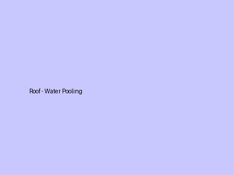
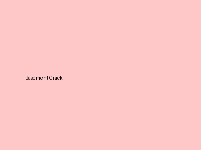
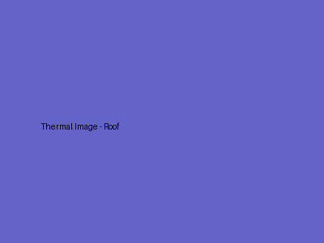

# Property Issue Summary
The property has identified issues related to water pooling on the roof near the HVAC unit and cracks in the north-facing basement wall. Additionally, thermal imaging has revealed cold spots near the HVAC unit and abnormal heating in the electrical panel.

# Area-wise Observations
## Roof Area
- **Observation**: The main roof area shows signs of water pooling near the HVAC unit.
- **Probable Root Cause**: Blocked drainage pipe under the unit.
- **Severity**: High.
- **Recommended Action**: Clear the blockage and inspect for structural damage.

## Basement Wall
- **Observation**: Cracks observed on the north-facing basement wall.
- **Probable Root Cause**: Soil settlement.
- **Severity**: Medium.

## Thermal Findings
- **Roof HVAC**: Temperature reading near the HVAC unit indicates cold spots (potential moisture).
  - **Max Temp**: 28C, **Min Temp**: 12C, **Delta T**: 16C.
  

- **Main Electrical Panel**: Breaker #4 shows abnormal heating.
  - **Max Temp**: 65C. Recommended Action: immediate inspection by electrician.
  

# Probable Root Cause
- The water pooling near the HVAC unit is likely due to a blocked drainage pipe.
- The cracks in the basement wall are probably caused by soil settlement.
- The cold spots near the HVAC unit suggest potential moisture issues, which align with the water pooling observation.
- The abnormal heating in the electrical panel indicates a separate electrical issue that requires immediate attention.

# Severity Assessment
- **Roof Area**: High severity due to potential structural damage from water pooling.
- **Basement Wall**: Medium severity as cracks may lead to further structural issues if not addressed.
- **Thermal Findings**: The HVAC cold spots indicate a moisture risk, while the electrical panel's abnormal heating poses an immediate safety risk.

# Recommended Actions
1. Clear the blockage in the drainage pipe near the HVAC unit and inspect for any structural damage.
2. Monitor and repair the cracks in the north-facing basement wall to prevent further deterioration.
3. Investigate the cold spots near the HVAC unit for moisture issues.
4. Conduct an immediate inspection of the electrical panel by a qualified electrician to address the abnormal heating.

# Additional Notes
- It is crucial to address the high severity issues promptly to prevent further damage and ensure safety.

# Missing or Unclear Information
- No additional information is available regarding the extent of structural damage from the water pooling or the specific repairs needed for the basement wall cracks.